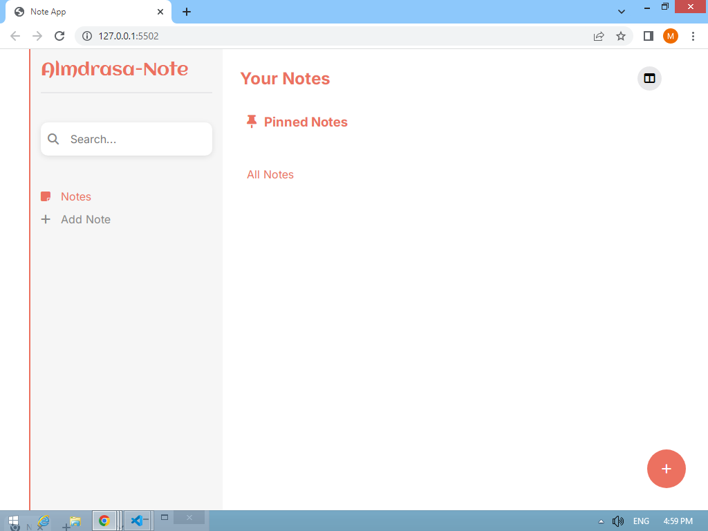
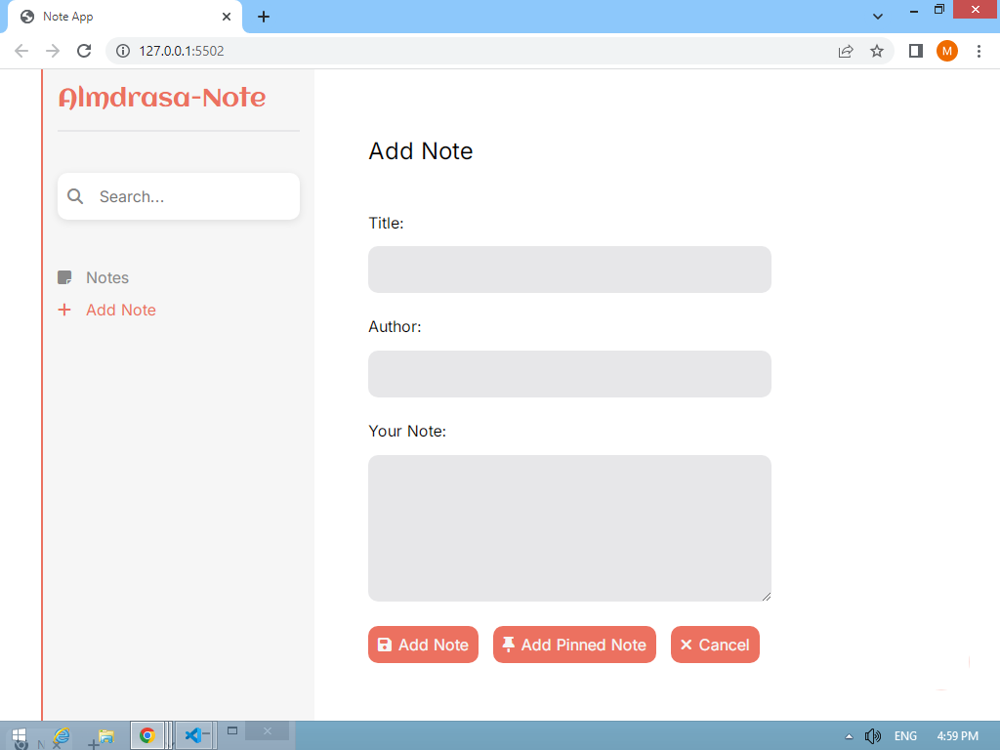

# Almdrasa Note App 📝

## 🖼 Screenshots

A simple, elegant, and responsive note-taking application to help you organize your thoughts, tasks, and reminders.

## Features ✨

- **Create Notes**: Add regular or pinned notes
- **Rich Text Notes**: Supports multi-line text formatting
- **Search Functionality**: Quickly find your notes
- **Pinned Notes**: Keep important notes at the top
- **Responsive Design**: Works on all devices (mobile, tablet, desktop)

## Technologies Used 🛠️

- HTML5
- CSS3 (with CSS Variables)
- JavaScript (ES6)
- Font Awesome Icons
- Google Fonts (Aclonica & Inter)

## Installation ⚙️

No installation required! Simply open `index.html` in your browser.

For development:

1. Clone this repository
2. Open `index.html` in your favorite browser
3. Start taking notes!

## Usage Guide 📖

### Adding Notes

1. Click "Add Note" button or the + FAB button
2. Fill in the title, author (optional), and your note
3. Click "Add Note" or "Add Pinned Note"

### Managing Notes

- **Search**: Type in the search bar to filter notes
- **Pin/Unpin**: Click the thumbtack icon to pin/unpin
- **Edit**: Click the edit icon to modify a note
- **Delete**: Click the trash icon to remove a note
- **View Details**: Click any note to see full content

### Responsive Design

- **Mobile**: Compact layout with essential features
- **Tablet**: Optimized for medium screens
- **Desktop**: Full sidebar navigation

## File Structure 📂

note-app/
├── index.html # Main application file
├── styles.css # All CSS styles
├── script.js # JavaScript functionality
├── normalize.css # CSS reset
└── README.md # This file

## Browser Support 🌐

- Chrome (latest)
- Firefox (latest)
- Edge (latest)
- Safari (latest)
- Mobile Safari
- Chrome for Android

## Contributing 🤝

Contributions are welcome! Please fork the repository and submit a pull request.

## License 📜

This project is licensed under the MIT License.

